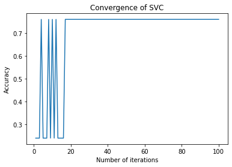

# Parameter Optimisation of SVM

## Introduction
This assignment illustrates a way of finding the optimal hyperparameter of Support Vector Classifier. The data set used here is Census-income dataset from UCI repository.

## Dataset
The data used contains 15 columns and 32561 rows. It is a synthetic dataset that reflects real predictive maintenance data encountered in industry.Out of 32561 rowsonly use 25000 rows after cleaning. Out of 15 columns, the following 13 columns are used:
age: continuous.
workclass: Private, Self-emp-not-inc, Self-emp-inc, Federal-gov, Local-gov, State-gov, Without-pay, Never-worked.
fnlwgt: continuous.
education: Bachelors, Some-college, 11th, HS-grad, Prof-school, Assoc-acdm, Assoc-voc, 9th, 7th-8th, 12th, Masters, 1st-4th, 10th, Doctorate, 5th-6th, Preschool.
education-num: continuous.
marital-status: Married-civ-spouse, Divorced, Never-married, Separated, Widowed, Married-spouse-absent, Married-AF-spouse.
occupation: Tech-support, Craft-repair, Other-service, Sales, Exec-managerial, Prof-specialty, Handlers-cleaners, Machine-op-inspct, Adm-clerical, Farming-fishing, Transport-moving, Priv-house-serv, Protective-serv, Armed-Forces.
relationship: Wife, Own-child, Husband, Not-in-family, Other-relative, Unmarried.
race: White, Asian-Pac-Islander, Amer-Indian-Eskimo, Other, Black.
sex: Female, Male.
hours-per-week: continuous.
native-country: United-States, Cambodia, England, Puerto-Rico, Canada, Germany, Outlying-US(Guam-USVI-etc), India, Japan, Greece, South, China, Cuba, Iran, Honduras, Philippines, Italy, Poland, Jamaica, Vietnam, Mexico, Portugal, Ireland, France, Dominican-Republic, Laos, Ecuador, Taiwan, Haiti, Columbia, Hungary, Guatemala, Nicaragua, Scotland, Thailand, Yugoslavia, El-Salvador, Trinadad&Tobago, Peru, Hong, Holand-Netherlands.
salary: >50K, <=50K

First 12 columns are used to predict the Machine Failure.

## Methodology
The dataset is split into training and testing set for 10 times and the following SVC classifier hyperparameter are selected for best accuracy:
- **Kernel** - Selected from RBF, Polynomial, Linear and Sigmoid
-  **C (Regularisation parameter)** - integer values { 0.1, 0.5, 1, 2, 3 }
- **Gamma (Kernel coefficient)** - Random integer values from { 1, 0.1, 0.01, 0.001, 0.0001 }. If the value is less than 1, then gamma is randomly set as auto or scale. It is used only by rbf, poly and sigmoid kernel.
- **Degree** - Random integer from 1 to 4. It is only used by poly kernel and represent the degree of polynomial kernel function.

The above hyperparameters are randomly selected from the given values for 100 iterations. The parameters that gave the best accuracy for each sample are shown in table below:

|Sample| Kernel   |   c | gamma   |   degree |   Accuracy |
|-----:|:---------|----:|:--------|---------:|-----------:|
|1     | rbf      | 0.5 | scale   |        1 |   0.7506   |
|2     | rbf      | 0.5 | auto    |        1 |   0.7493   |
|3     | rbf      | 0.1 | scale   |        1 |   0.7610   |
|4     | rbf      |   3 | scale   |        1 |   0.7506   |
|5     | rbf      | 0.1 | auto    |        2 |   0.7486   |
|6     | rbf      |   2 | scale   |        1 |   0.7480   |
|7     | rbf      | 0.1 | auto    |        1 |   0.7440   |
|8     | rbf      |   1 | scale   |        1 |   0.7476   |
|9     | rbf      |   1 | auto    |        1 |   0.7483   |
|10    | rbf      | 0.1 | auto    |        1 |   0.7546   |

The following Convergence graph shows the accuracy of sample 3 (maximum accuracy) over the 100 iterations:

## Result
The best parameters of SVC for the given dataset are:
- Kernel : rbf
- C : 0.1
- Gamma : scale
- Degree : NA

The above parameter gave a maximum accuracy of 0.7610.